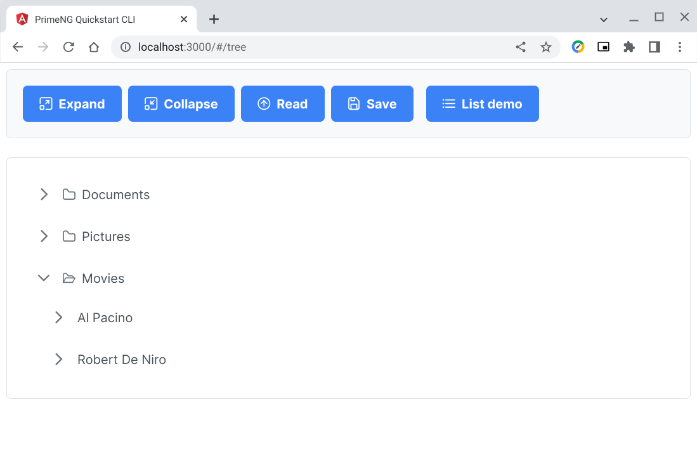

# pgsql-query-json

## Generate JSON data from PostgreSQL table

> ***This tutorial requires some knowledge in Linux, Docker, Git, Angular, PostgreSQL, and Go Programming Language.***

### Table of Contents
1. [Introduction](https://github.com/cydriclopez/pgsql-query-json#1-introduction)
2. [Goal](https://github.com/cydriclopez/pgsql-query-json#2-goal)
3. [Clone this repo](https://github.com/cydriclopez/pgsql-query-json#3-clone-this-repo)
4. [Docker stuff](https://github.com/cydriclopez/pgsql-query-json#4-docker-stuff)
5. [Angular code](https://github.com/cydriclopez/pgsql-query-json#5-angular-code)
6. [Go server code](https://github.com/cydriclopez/pgsql-query-json#6-go-server-code)
7. [PostgreSQL code](https://github.com/cydriclopez/pgsql-query-json#7-postgresql-code)
8. [Running the ***webserv*** app](https://github.com/cydriclopez/pgsql-query-json#8-running-the-go-webserv-app)
9. [Conclusion](https://github.com/cydriclopez/pgsql-query-json#9-conclusion)

### 1. Introduction

We continue where the [previous tutorial](https://github.com/cydriclopez/pgsql-parse-json) ended. This tutorial concludes this series on dealing with JSON data from a tree GUI component.

In this tutorial we write the Angular client code to read JSON data from our Go GET controller code which we will write as well. Our Go controller code will call Postgresql. We will also write a stored-function to generate JSON data.

Our Go controller serves to connect the Angular client code to Postgresql database records. Our Go code has a demo for hosting static files. It also has demo for GET and POST controllers. The Go code is mostly restful and can be called from any client webapp, not necessarily from Angular.

In this tutorial I have tried to simplify the docker code. I have tried to decouple the aliases from the ~/.bashrc file.

### 2. Goal

The goal of this tutorial is to read the tree GUI JSON data from Postgresql and display it in the Angular client web app. This is the reverse of the [previous tutorial's](https://github.com/cydriclopez/pgsql-parse-json) goal which was to write data to the database from our client web app.

Our goal is to read records in table ***tree_data***:

```bash
user1@penguin:~/Projects/github/pgsql-query-json$
:psql
psql (14.2 (Debian 14.2-1.pgdg110+1))
Type "help" for help.

postgres=# select * from tree_data;
 key | parent |     label      |    icon     |   expandedicon    | collapsedicon |          data           | leaf | toexpand
-----+--------+----------------+-------------+-------------------+---------------+-------------------------+------+----------
   1 |      0 | data           |             |                   |               | data                    | f    | t
   2 |      1 | Documents      |             | pi pi-folder-open | pi pi-folder  | Documents Folder        | f    | f
   3 |      2 | Work           |             | pi pi-folder-open | pi pi-folder  | Work Folder             | f    | f
   4 |      3 | Expenses.doc   | pi pi-file  |                   |               | Expenses Document       | t    | f
   5 |      3 | Resume.doc     | pi pi-file  |                   |               | Resume Document         | t    | f
   6 |      2 | Home           |             | pi pi-folder-open | pi pi-folder  | Home Folder             | f    | f
   7 |      6 | Invoices.txt   | pi pi-file  |                   |               | Invoices for this month | t    | f
   8 |      1 | Pictures       |             | pi pi-folder-open | pi pi-folder  | Pictures Folder         | f    | f
   9 |      8 | barcelona.jpg  | pi pi-image |                   |               | Barcelona Photo         | t    | f
  10 |      8 | logo.jpg       | pi pi-image |                   |               | PrimeFaces Logo         | t    | f
  11 |      8 | primeui.png    | pi pi-image |                   |               | PrimeUI Logo            | t    | f
  12 |      1 | Movies         |             | pi pi-folder-open | pi pi-folder  | Movies Folder           | f    | t
  13 |     12 | Al Pacino      |             |                   |               | Pacino Movies           | f    | f
  14 |     13 | Scarface       | pi pi-video |                   |               | Scarface Movie          | t    | f
  15 |     13 | Serpico        | pi pi-video |                   |               | Serpico Movie           | t    | f
  16 |     12 | Robert De Niro |             |                   |               | De Niro Movies          | f    | f
  17 |     16 | Goodfellas     | pi pi-video |                   |               | Goodfellas Movie        | t    | f
  18 |     16 | Untouchables   | pi pi-video |                   |               | Untouchables Movie      | t    | f
(18 rows)
```

And then transform them into JSON format via Postgresql function [tree_json()](https://github.com/cydriclopez/pgsql-query-json/blob/main/src/pgsql/tree_json.sql).

```bash
postgres=# select jsonb_pretty(tree_json());
                          jsonb_pretty
----------------------------------------------------------------
 {                                                             +
     "data": [                                                 +
         {                                                     +
             "data": "Documents Folder",                       +
             "label": "Documents",                             +
             "children": [                                     +
                 {                                             +
                     "data": "Work Folder",                    +
                     "label": "Work",                          +
                     "children": [                             +
                         {                                     +
                             "data": "Expenses Document",      +
                             "icon": "pi pi-file",             +
                             "label": "Expenses.doc"           +
                         },                                    +
                         {                                     +
                             "data": "Resume Document",        +
                             "icon": "pi pi-file",             +
                             "label": "Resume.doc"             +
                         }                                     +
                     ],                                        +
                     "toexpand": false,                        +
                     "expandedIcon": "pi pi-folder-open",      +
                     "collapsedIcon": "pi pi-folder"           +
                 },                                            +
                 {                                             +
                     "data": "Home Folder",                    +
--More--
```

And then feed this JSON data into our web app for display in our tree component:
<br/>
<kbd></kbd>
<br/>

### 3. Clone this repo

I assume you know about [GNU/Linux](https://www.debian.org/releases/jessie/amd64/ch01s02.html.en). I also assume you have [Docker](https://docs.docker.com/engine/install/) and [Git](https://git-scm.com/download/linux) installed. These are basic essentials for software developers these days and life without them is just impossible.😊

In my ***~/.bashrc*** file I have a line ***export PS1=$PS1'\n:'*** which results in my command line prompt as shown below (i.e. ***user1@penguin:~\$***). This way no matter how long is my path, my prompt is always on the next line down then second character from the left and right after the colon ":" character. I have just added extra line-feed and comments (starts with #) between prompts for clarity.

To lessen confusion, as far as folders are concerned, I have adopted ***~/Projects/github/*** as the root project folder for this tutorial. I trust that you know what you are doing if you divert from this norm.

Follow carefully the command line instructions (cli) below to clone this project.

```bash
# From your home folder make a directory ~/Projects/github.
# The -p parameter creates the whole path if it does not exist.
user1@penguin:~$
:mkdir -p ~/Projects/github

# Change directory into the just created folder
user1@penguin:~$
:cd ~/Projects/github

# Clone this project
user1@penguin:~/Projects/github$
:git clone https://github.com/cydriclopez/pgsql-query-json.git

# Change directory into the just cloned docker stuff folder.
user1@penguin:~/Projects/github$
:cd pgsql-query-json/src/docker

# This is the folder with all the docker stuff discussed next
user1@penguin:~/Projects/github/pgsql-query-json/src/docker$
:
```

### 4. Docker stuff

I have tried to decouple my "docker run" aliases from the ***~/.bashrc*** file. You can tell that I am new to this thing. I learn as I go. Nothing beats learning by having to teach it. As the adage goes "You can only teach what you have learned." Or, "If you cannot teach it, then you haven't really learned it." 😊

Our Docker code consists of 5 files located in folder [src/docker](https://github.com/cydriclopez/pgsql-query-json/tree/main/src/docker).

| # | file   | location | purpose |
| --- | ----------- | --- | ----------- |
| 1 | angular.dockerfile | [src/docker/angular.dockerfile](https://github.com/cydriclopez/pgsql-query-json/blob/main/src/docker/angular.dockerfile) | create Angular image |
| 2 | docker_alias.sh | [src/docker/docker_alias.sh](https://github.com/cydriclopez/pgsql-query-json/blob/main/src/docker/docker_alias.sh) | create "docker run" aliases |
| 3 | docker_init.sh | [src/docker/docker_init.sh](https://github.com/cydriclopez/pgsql-query-json/blob/main/src/docker/docker_init.sh) | create Angular & Postgresql containers |
| 4 | postgres.dockerfile | [src/docker/postgres.dockerfile](https://github.com/cydriclopez/pgsql-query-json/blob/main/src/docker/postgres.dockerfile) | create Postgresql image |
| 5 | README.md | [src/docker/README.md](https://github.com/cydriclopez/pgsql-query-json/blob/main/src/docker/README.md) | readme file |

Follow carefully the command line instructions (cli) below to create the needed docker images and containers for this project. Comment lines start with character "#".

```bash
# ll is my alias for "ls --color -lah --group-directories-first" command
user1@penguin:~/Projects/github/pgsql-query-json/src/docker$
:ll

drwxr-xr-x 1 user1 user1  150 Oct  5 13:32 .
drwxr-xr-x 1 user1 user1   46 Oct  2 21:25 ..
-rw-r--r-- 1 user1 user1  500 Oct  5 13:39 angular.dockerfile
-rw-r--r-- 1 user1 user1  889 Oct  5 13:36 docker_alias.sh
-rw-r--r-- 1 user1 user1 1.2K Oct  5 13:36 docker_init.sh
-rw-r--r-- 1 user1 user1  239 Oct  5 13:38 postgres.dockerfile
-rw-r--r-- 1 user1 user1   22 Oct  2 22:39 README.md

# Run "source docker_init.sh" to create the Angular &
# Postgresql images. This will also run "source docker_alias.sh"
# to create the Angular & Postgresql containers.
user1@penguin:~/Projects/github/pgsql-query-json/src/docker$
:source docker_init.sh
 .
 :
[truncated Docker messages]
 .
 :
# At this point our Angular & Postgresql images & containers are ready
user1@penguin:~/Projects/github/pgsql-query-json/src/docker$
:pgstart
postgres14

user1@penguin:~/Projects/github/pgsql-query-json/src/docker$
:psql
psql (14.5 (Debian 14.5-1.pgdg110+1))
Type "help" for help.

# Try query the Postgresql version. It works!
postgres=# select version();
                                                           version
-----------------------------------------------------------------------------------------------------------------------------
 PostgreSQL 14.5 (Debian 14.5-1.pgdg110+1) on x86_64-pc-linux-gnu, compiled by gcc (Debian 10.2.1-6) 10.2.1 20210110, 64-bit
(1 row)

# Exit out of Postgresql
postgres=# \q

# We are back into our bash console. Try run Angular.
user1@penguin:~/Projects/github/pgsql-query-json/src/docker$
:angular
/home/node/ng # ng -v

     _                      _                 ____ _     ___
    / \   _ __   __ _ _   _| | __ _ _ __     / ___| |   |_ _|
   / △ \ | '_ \ / _` | | | | |/ _` | '__|   | |   | |    | |
  / ___ \| | | | (_| | |_| | | (_| | |      | |___| |___ | |
 /_/   \_\_| |_|\__, |\__,_|_|\__,_|_|       \____|_____|___|
                |___/


Angular CLI: 14.2.5
Node: 14.18.3
Package Manager: npm 6.14.15
OS: linux x64

Angular:
...

Package                      Version
------------------------------------------------------
@angular-devkit/architect    0.1402.5 (cli-only)
@angular-devkit/core         14.2.5 (cli-only)
@angular-devkit/schematics   14.2.5 (cli-only)
@schematics/angular          14.2.5 (cli-only)

# Yay! Angular works! Let's exit for now.
/home/node/ng # exit

# We are back again in our local bash session
user1@penguin:~/Projects/github/pgsql-query-json/src/docker$
:
```


### 5. Angular code
### 6. Go server code
### 7. PostgreSQL code
### 8. Running the Go ***webserv*** app
### 9. Conclusion

---

This is under construction but you can peek into the completed [source code folder](https://github.com/cydriclopez/pgsql-query-json/tree/main/src).😊
