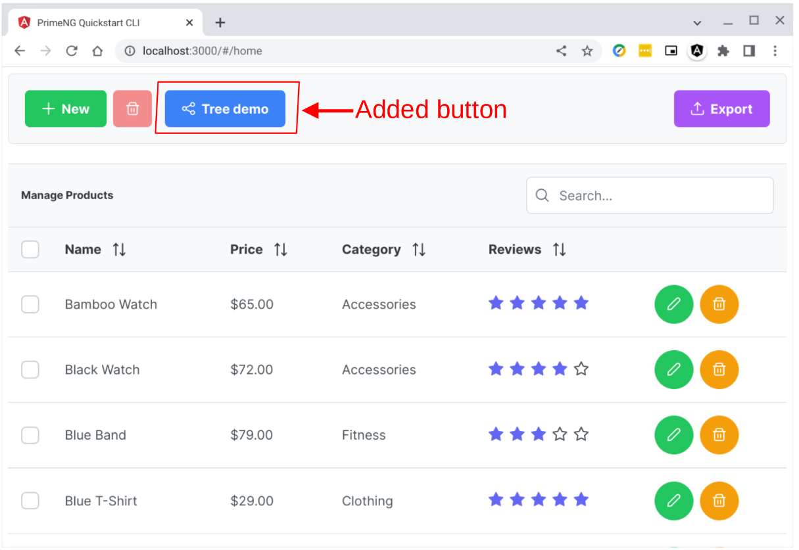

# pgsql-query-json

## Generate JSON data from PostgreSQL table

> ***This tutorial requires some knowledge in Linux, Docker, Git, Angular, PostgreSQL, and Go Programming Language.***

### Table of Contents
1. [Introduction](https://github.com/cydriclopez/pgsql-query-json#1-introduction)
2. [Scope](https://github.com/cydriclopez/pgsql-query-json#2-scope)
3. [Goal](https://github.com/cydriclopez/pgsql-query-json#3-goal)
4. [Clone this project](https://github.com/cydriclopez/pgsql-query-json#4-clone-this-project)
5. [Docker stuff](https://github.com/cydriclopez/pgsql-query-json#5-docker-stuff)
6. [Client code](https://github.com/cydriclopez/pgsql-query-json#6-client-code)
7. [Server code](https://github.com/cydriclopez/pgsql-query-json#7-server-code)
8. [PostgreSQL code](https://github.com/cydriclopez/pgsql-query-json#8-postgresql-code)
9. [Running the ***webserv*** app](https://github.com/cydriclopez/pgsql-query-json#9-running-the-webserv-app)
10. [Conclusion](https://github.com/cydriclopez/pgsql-query-json#10-conclusion)

### 1. Introduction

We continue where the [previous tutorial](https://github.com/cydriclopez/pgsql-parse-json) ended. This tutorial concludes this series on dealing with JSON data from a tree GUI component.

In this tutorial we write the Angular client code to read JSON data from our Go GET controller code which we will write as well. Our Go controller code will call Postgresql. We will also write a stored-function to generate JSON data.

Our Go controller serves to connect the Angular client code to Postgresql database records. Our Go code has a demo for hosting static files. It also has demo for GET and POST controllers. The Go code is mostly restful and can be called from any client webapp, not necessarily from Angular.

In this tutorial I have tried to simplify the docker code. I have tried to decouple the aliases from the ~/.bashrc file.

### 2. Scope

This tutorial simply presents the narrow topic of JSON data passing between the client and the server, specifically the Postgresql database server. There is a dearth of material on this specific topic so I endeavored to write about it. With Angular, JSON is the primary way of talking to a server via APIs. I also try to highlight the Postgresql JSON features.

Here we will not discuss authentication/authorization, logging, deployment, and data replication, caching and backup. We will also not cover unit, integration, and end-to-end testing. So much more is involved in a full-stack web app development. I am trying to fit writing this tutorial into my current obligations. I have to narrow down the scope or else, I will have to make you sign a non-disclosure agreement. Just kidding!😊

### 3. Goal

The goal of this tutorial is to read the tree GUI JSON data from Postgresql and display it in the Angular client web app. This is the reverse of the [previous tutorial's](https://github.com/cydriclopez/pgsql-parse-json) goal which was to write data to the database from our client web app.

Our goal is to read records in table ***tree_data***:

```bash
user1@penguin:~/Projects/github/pgsql-query-json$
:psql
psql (14.2 (Debian 14.2-1.pgdg110+1))
Type "help" for help.

postgres=# select * from tree_data;
 key | parent |     label      |    icon     |   expandedicon    | collapsedicon |          data           | leaf | toexpand
-----+--------+----------------+-------------+-------------------+---------------+-------------------------+------+----------
   1 |      0 | data           |             |                   |               | data                    | f    | t
   2 |      1 | Documents      |             | pi pi-folder-open | pi pi-folder  | Documents Folder        | f    | f
   3 |      2 | Work           |             | pi pi-folder-open | pi pi-folder  | Work Folder             | f    | f
   4 |      3 | Expenses.doc   | pi pi-file  |                   |               | Expenses Document       | t    | f
   5 |      3 | Resume.doc     | pi pi-file  |                   |               | Resume Document         | t    | f
   6 |      2 | Home           |             | pi pi-folder-open | pi pi-folder  | Home Folder             | f    | f
   7 |      6 | Invoices.txt   | pi pi-file  |                   |               | Invoices for this month | t    | f
   8 |      1 | Pictures       |             | pi pi-folder-open | pi pi-folder  | Pictures Folder         | f    | f
   9 |      8 | barcelona.jpg  | pi pi-image |                   |               | Barcelona Photo         | t    | f
  10 |      8 | logo.jpg       | pi pi-image |                   |               | PrimeFaces Logo         | t    | f
  11 |      8 | primeui.png    | pi pi-image |                   |               | PrimeUI Logo            | t    | f
  12 |      1 | Movies         |             | pi pi-folder-open | pi pi-folder  | Movies Folder           | f    | t
  13 |     12 | Al Pacino      |             |                   |               | Pacino Movies           | f    | f
  14 |     13 | Scarface       | pi pi-video |                   |               | Scarface Movie          | t    | f
  15 |     13 | Serpico        | pi pi-video |                   |               | Serpico Movie           | t    | f
  16 |     12 | Robert De Niro |             |                   |               | De Niro Movies          | f    | f
  17 |     16 | Goodfellas     | pi pi-video |                   |               | Goodfellas Movie        | t    | f
  18 |     16 | Untouchables   | pi pi-video |                   |               | Untouchables Movie      | t    | f
(18 rows)
```

And then transform them into JSON format via Postgresql function [tree_json()](https://github.com/cydriclopez/pgsql-query-json/blob/main/src/pgsql/tree_json.sql).

```bash
postgres=# select jsonb_pretty(tree_json());
                          jsonb_pretty
----------------------------------------------------------------
 {                                                             +
     "data": [                                                 +
         {                                                     +
             "data": "Documents Folder",                       +
             "label": "Documents",                             +
             "children": [                                     +
                 {                                             +
                     "data": "Work Folder",                    +
                     "label": "Work",                          +
                     "children": [                             +
                         {                                     +
                             "data": "Expenses Document",      +
                             "icon": "pi pi-file",             +
                             "label": "Expenses.doc"           +
                         },                                    +
                         {                                     +
                             "data": "Resume Document",        +
                             "icon": "pi pi-file",             +
                             "label": "Resume.doc"             +
                         }                                     +
                     ],                                        +
                     "toexpand": false,                        +
                     "expandedIcon": "pi pi-folder-open",      +
                     "collapsedIcon": "pi pi-folder"           +
                 },                                            +
                 {                                             +
                     "data": "Home Folder",                    +
--More--
```

And then feed this JSON data into our web app for display in our tree component:
<br/>
<kbd></kbd>
<br/>

### 4. Clone this project

I assume you know about [GNU/Linux](https://www.debian.org/releases/jessie/amd64/ch01s02.html.en). I also assume you have [Docker](https://docs.docker.com/engine/install/) and [Git](https://git-scm.com/download/linux) installed. These are basic essentials for software developers these days and life without them is just impossible.😊

To lessen confusion, as far as folders are concerned, I have adopted ***~/Projects/github/*** as the root project folder for this tutorial. **I trust that you know what you are doing if you divert from this norm.**

Follow carefully the command line instructions (cli) below to clone this project.

```bash
# 4.1. Create then change into our root project folder
$ mkdir -p ~/Projects/github
$ cd ~/Projects/github

# 4.2. Clone this project
$ git clone https://github.com/cydriclopez/pgsql-query-json.git

# 4.3. Change into the project's src directory
$ cd pgsql-query-json/src

# 4.4. Directory src is where we run our docker commands
$ pwd
~/Projects/github/pgsql-query-json/src
```

### 5. Docker stuff

I have refreshed this Docker section to use ***docker compose*** to create the necessary docker images.

Our Docker code consists of 5 files located in folder [pgsql-query-json/src](https://github.com/cydriclopez/pgsql-query-json/tree/main/src).

| # | file   | location | purpose |
| --- | ----------- | --- | ----------- |
| 1 | .dockerignore | [src/.dockerignore](https://github.com/cydriclopez/pgsql-query-json/blob/main/src/.dockerignore) | Declare files to ignore in docker compose |
| 2 | alias.sh | [src/alias.sh](https://github.com/cydriclopez/pgsql-query-json/blob/main/src/alias.sh) | load command-line aliases |
| 3 | Dockerfile | [src/Dockerfile](https://github.com/cydriclopez/pgsql-query-json/blob/main/src/Dockerfile) | Docker compose default Dockerfile |
| 4 | compose-angular.yaml | [src/compose-angular.yaml](https://github.com/cydriclopez/pgsql-query-json/blob/main/src/compose-angular.yaml) | Used to build the Angular image |
| 5 | compose.yaml | [src/compose.yaml](https://github.com/cydriclopez/pgsql-query-json/blob/main/src/compose.yaml) | Default docker compose file |


### 6. Client code

Now that this project is cloned into your ~/Projects/github/pgsql-query-json folder, it is time to create our needed docker images.

#### 6.1. Create Angular docker image

```bash
# 6.1.1. Make sure we are in the pgsql-query-json/src folder
$ cd ~/Projects/github/pgsql-query-json/src
$ pwd
~/Projects/github/pgsql-query-json/src

# 6.1.2. Create Angular docker image
$ docker compose -f compose-angular.yaml build

# 6.1.3. List our images
$ docker images

REPOSITORY   TAG             IMAGE ID       CREATED        SIZE
angular      latest          8c737311abb5   2 days ago     171MB
node         14.18-alpine    194cd0d85d8a   9 months ago   118MB
```

At this point our Angular docker image ***angular:latest*** is ready for use to compile our Angular source code. To run this ***angular:latest*** image we will use the ***angular*** alias defined in the script ***alias.sh*** in the next section.

#### 6.2. Compile our Angular source code

```bash
# 6.2.1. Make sure we are in the pgsql-query-json/src folder
$ cd ~/Projects/github/pgsql-query-json/src

# 6.2.2. Load angular alias
$ source alias.sh

# 6.2.3. Now that the angular alias is loaded let's run it
$ angular

# 6.2.4. The angular alias brings us into the Angular container
/home/node #

# 6.2.5. Change folder into pgsql-query-json
/home/node # cd pgsql-query-json

# 6.2.6. Compile our Angular source code
/home/node/pgsql-query-json # ng build

# 6.2.7. Exit after the compile process
/home/node/pgsql-query-json # exit
```

At this point our Angular compiled generated static code is ready to use in folder ***src/client/dist/primeng-quickstart-cli***. In the next section this generated folder is copied into our Webapp image as defined in the Dockerfile. We are using a 2-stage build, using a debian-slim image, to minimize the final Webapp docker image.

### 7. Server code

```bash
# 7.1. Make sure we are in the pgsql-query-json/src folder
$ cd ~/Projects/github/pgsql-query-json/src

# 7.2. Go, Webapp, and Postgresql build
$ docker compose build

# 7.3. List our images
$ docker images

REPOSITORY   TAG             IMAGE ID       CREATED        SIZE
webapp       1.0             a820de5e4946   44 hours ago   103MB
angular      latest          8c737311abb5   2 days ago     171MB
postgres     14              cecf89e3640c   2 weeks ago    376MB
golang       bullseye        8827cedaa309   4 weeks ago    992MB
debian       bullseye-slim   e7bb3280b4c7   4 weeks ago    80.5MB
node         14.18-alpine    194cd0d85d8a   9 months ago   118MB

# 7.4. Webapp run
$ docker compose up
```

At this point our ***webapp*** and ***Postgresql*** is up and running. Everything is ready **except for our database.** In the next section we will prepare our database.

### 8. Postgresql code

While ***docker compose up*** is running, <ins>**open another terminal**</ins> to run the steps below. Step ***8.5.*** creates our Postgresql data structures so we can access it from our ***webapp.***

```bash
# 8.1. Make sure we are in the pgsql-query-json/src folder
$ cd ~/Projects/github/pgsql-query-json/src

# 8.2. Load psql alias
$ source alias.sh

# 8.3. Alias psql brings us inside the Postgres container
$ psql
psql (14.5 (Debian 14.5-2.pgdg110+2))
Type "help" for help.

# 8.4. Change directory into /home
postgres=# \cd /home

# 8.5. Create our Postgresql data structures
postgres=# \i _prepare_db.sql

# 8.6. Exit for now
postgres=# exit
```

At this point both our webapp and Postgres database are ready.

### 9. Running the ***webserv*** app

Browse the webapp in http://localhost:3000.

#### 9.1. I added the ***Tree Demo*** button to display the tree-demo page:
<kbd></kbd>
<br/>

#### 9.2. The ***Tree Demo*** page where we implement the client code in this tutorial:
<kbd></kbd>
<br/>

Test our webapp:

1. Expand or collapse branches of the tree component.
2. Click ***Save*** to save the state of the tree component.
3. Expand or collapse branches of the tree component.
4. Click ***Read*** to read from the database. It should revert to #1.
5. The JSON data should show in the console where ***docker compose up*** is running.

Press Ctrl-C to exit out of the ***docker compose up*** process.

### 10. Conclusion

This is the end of this JSON processing tutorial series. The key is the proper coordination of various key pieces of code.

#### 10.1. Client code

| # | file   | purpose |
| --- | ----------- | ----------- |
| 1 | [treedemo.component.html](https://github.com/cydriclopez/pgsql-query-json/blob/main/src/client/src/app/treedemo/treedemo.component.html) | HTML template for tree webapp |
| 2 | [treedemo.component.ts](https://github.com/cydriclopez/pgsql-query-json/blob/main/src/client/src/app/treedemo/treedemo.component.ts) | Tree webapp TypeScript code |
| 3 | [nodeservice.ts](https://github.com/cydriclopez/pgsql-query-json/blob/main/src/client/src/app/services/nodeservice.ts) | Tree webapp service |

#### 10.2. Server code

| # | file   | purpose |
| --- | ----------- | ----------- |
| 1 | [common.go](https://github.com/cydriclopez/pgsql-query-json/blob/main/src/server/common/common.go) | Postgresql connector |
| 2 | [treedata.go](https://github.com/cydriclopez/pgsql-query-json/blob/main/src/server/treedata/treedata.go) | Process the tree JSON data |

#### 10.3. Postgresql code

| # | file   | purpose |
| --- | ----------- | ----------- |
| 1 | [tree_insert.sql](https://github.com/cydriclopez/pgsql-query-json/blob/main/src/pgsql/tree_insert.sql) | Create function tree_insert() |
| 2 | [tree_json.sql](https://github.com/cydriclopez/pgsql-query-json/blob/main/src/pgsql/tree_json.sql) | Create function tree_json() |

I hope this is helpful.

Happy coding! 😊
---
